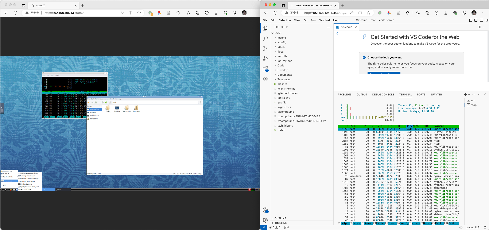

# code-server-speit

A WebIDE for SPEIT IE course



## Introduction

- Supported code-server versions: 3.12.0 - 4.9.1

## How to build

1. Step 1: `scrips/build/bootstrap.sh`

    Run `scrips/build/bootstrap.sh` to download coder-server release

    Usage:

    ```shell
    ./scripts/build/bootstrap.sh <arch> <version>
    ```

    e.g.

    ```shell
    ./scripts/build/bootstrap.sh amd64 4.7.0
    ```

    or

    ```shell
    ./scripts/build/bootstrap.sh
    ```

    > This will download latest release for amd64

    > Check [https://github.com/coder/code-server/releases](https://github.com/coder/code-server/releases) for supported architectures and versions.

    The bootstrap.sh will create `./home` directory with following structure

    ```text
    home
    └── .config
        └── code-server
            └── CONFIGURED
    ```

2. Step 2: `script/build/build.sh`
    Run `script/build/build.sh`

## How to use

This image can be deployed using `docker-compose`:

```yaml
version: '3'
services:
  ide:
    image: davidliyutong/code-server-speit:dev
    container_name: coder-dev
    ports:
      - 3000:3000
      - 6080:80
```

```shell
cd manifests/docker
docker-compose up
```

The container expose port `3000` for coder IDE and `80` for noVNC. If the container is behind proxy, then the proxy must support both HTTP and Websocket connections.

If no volume is mounted, all changes will be lost after container destruction. Consider mapping a volume to `/root`.

## Reboot the container

To reboot container, kill the daemon process inside container.

```shell
kill -9 $(ps -ef|grep "/usr/local/bin/tini -- supervisord -n -c /etc/supervisor/supervisord.conf" |grep -v grep |awk '{print $2}')
```

> `alias restart-container="kill -9 $(ps -ef|grep "/usr/local/bin/tini -- supervisord -n -c /etc/supervisor/supervisord.conf" |grep -v grep |awk '{print $2}')"` could be added to shell profile

## Reset the container

The `home` directory will be packed copied to `/opt/home.tar.xz` of the container. During the initialization The entry script `run-coder.sh` will check the existence of `/root/.config/code-server/CONFIGURED`. If this file does not exist, the script will extrat the content of `/opt/home.tar.xz` to `/root`.

To reset the container, simply perform delete `/root/.config/code-server/CONFIGURED` in the container and reboot the container.

## How to deploy to K8S clusters

Requirement:

 - ingress controller installed
 - default storage class configured
 - a tls secret to secure ingress traffic (optional)

There is this `deployment/deployment-template.yaml` template. During deployment the `{{ID}}` should be replaced with unique user identifiers. The lines marked with `CHANGE` me should be modified according to your cluster configuration

```yaml
apiVersion: v1
kind: PersistentVolumeClaim
metadata:
  name: code-server-pvc-${{ ID }}
spec:
  accessModes:
  - ReadWriteOnce
  resources:
    requests:
      storage: 10Gi # CHANGEME Storage Limit
---
apiVersion: apps/v1
kind: Deployment
metadata:
  labels:
    k8s-app: apps.code-server-${{ ID }}
  name: code-server-${{ ID }}
spec:
  replicas: 1
  selector:
    matchLabels:
      k8s-app: apps.code-server-${{ ID }}
  template:
    metadata:
      labels:
        k8s-app: apps.code-server-${{ ID }}
    spec:
      containers:
      - image: davidliyutong/code-server-speit:v4.9.1 # CHANGEME
        imagePullPolicy: IfNotPresent
        name: container-0
        ports:
        - containerPort: 3000
          name: 3000tcp
          protocol: TCP
        - containerPort: 80
          name: 80tcp
          protocol: TCP
        resources: # CHANGEME
          limits:
            cpu: "4"
            memory: 4Gi
          requests:
            cpu: 50m
            memory: 512Mi
        securityContext:
          allowPrivilegeEscalation: true
          capabilities: {}
          privileged: false
          readOnlyRootFilesystem: false
        volumeMounts:
        - mountPath: /root
          name: home
      dnsPolicy: ClusterFirst
      restartPolicy: Always
      terminationGracePeriodSeconds: 30
      volumes:
      - name: home
        persistentVolumeClaim:
          claimName: code-server-pvc-${{ ID }}
---
apiVersion: v1
kind: Service
metadata:
  name: code-server-svc-${{ ID }}
spec:
  ports:
  - name: 3000tcp
    port: 3000
    protocol: TCP
    targetPort: 3000
  - name: 6080tcp80
    port: 6080
    protocol: TCP
    targetPort: 80
  selector:
    k8s-app: apps.code-server-${{ ID }}
  sessionAffinity: None
  type: ClusterIP
---
apiVersion: networking.k8s.io/v1
kind: Ingress
metadata:
  annotations: 
    nginx.ingress.kubernetes.io/rewrite-target: /$2
    nginx.ingress.kubernetes.io/proxy-body-size: "4096M"
  name: coder-server-ingress-${{ ID }}
spec:
  ingressClassName: public
  rules:
  - host: ${{ CODE_HOSTNAME }} # CHANGEME
    http:
      paths:
      - backend:
          service:
            name: code-server-svc-${{ ID }}
            port:
              number: 3000
        path: /${{ ID }}(/|$)(.*)
        pathType: Prefix
  - host: ${{ VNC_HOSTNAME }} # CHANGEME
    http:
      paths:
      - backend:
          service:
            name: code-server-svc-${{ ID }}
            port:
              number: 6080
        path: /${{ ID }}(/|$)(.*)
        pathType: Prefix
  tls:
  - hosts:
    - ${{ CODE_HOSTNAME }} # CHANGEME hostname
    secretName: ${{ CODE_TLS_SECRET }} # CHANGEME TLS Secret
  - hosts:
    - ${{ VNC_HOSTNAME }} # CHANGEME hostname
    secretName: ${{ VNC_TLS_SECRET }} # CHANGEME TLS Secret
```

Apply the rendered template with `kubectl`

```shell
kubectl apply -f deployment/deployment.id.yaml -n <namespace>
```

### render

`scripts/crd/render.go` provide a simple render of template that can replace `${{ ID }}` with from `csv` file or integers. For example

```shell
go build scripts/crd/render.go
./render --template_path=./deployment/deployment-template.yaml --mode=csv --csv_path=./id.csv
```

`./id.csv`:

```csv
001,...
002,...
003,...
```

This will create `deployment-001.yaml`, `deployment-002.yaml` and `deployment-003.yaml`

`scripts/crd/render.sh` is more complicated.
